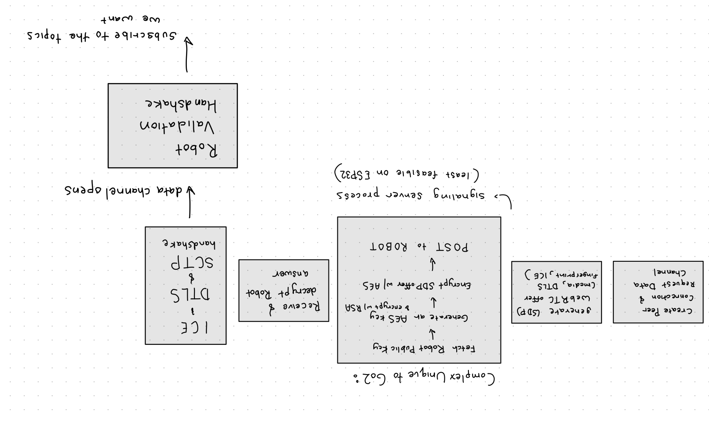
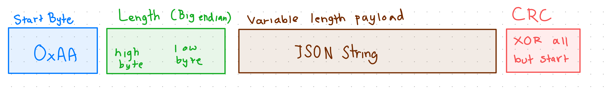
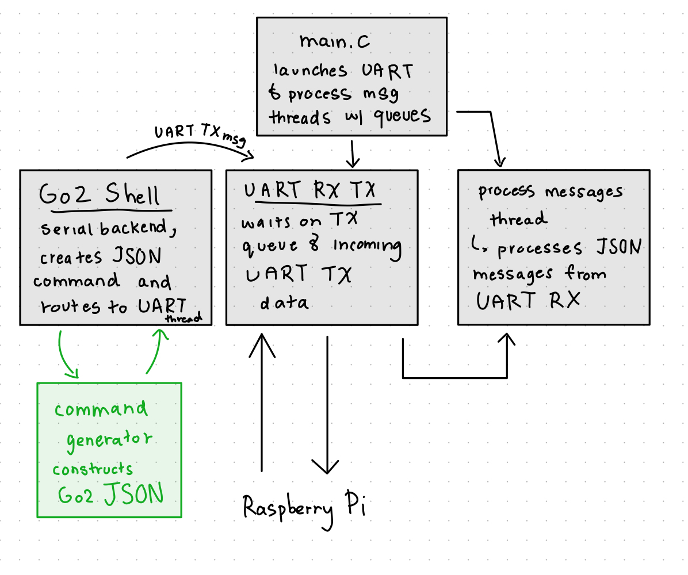
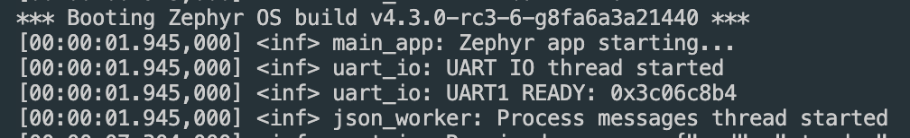
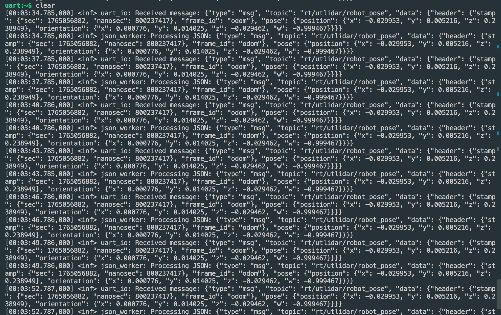
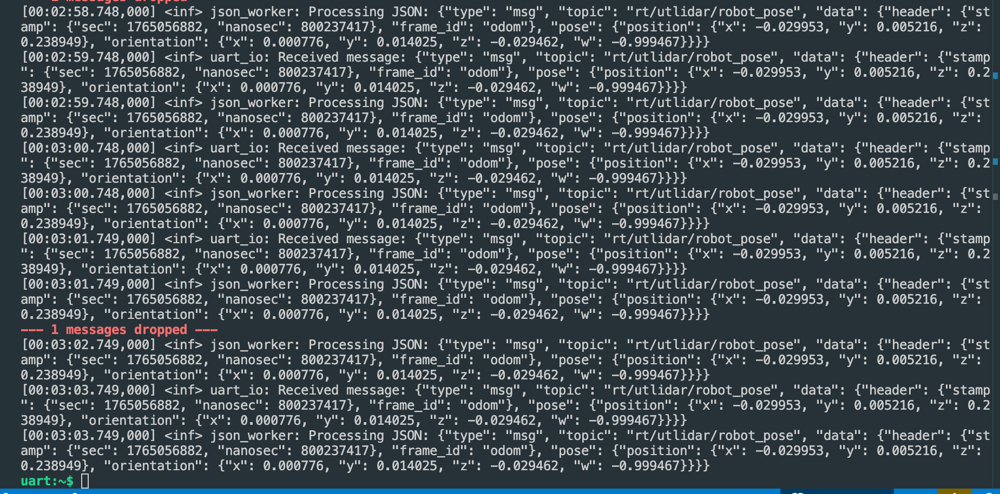
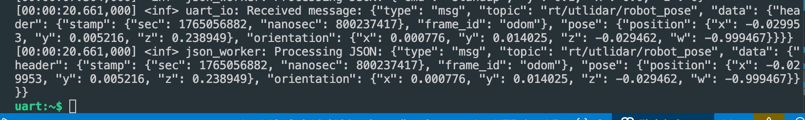
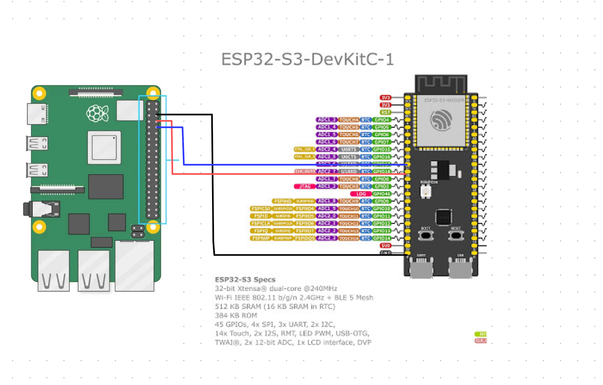

# **Exploring Real-Time WebRTC Interface on MCUs & MPUs for Unitree GO2 Robots**

*ESP32 and Raspberry Pi interface for communicating with Unitree Go2 Robots*

---

## 👥 **Team**

- Akshara Kuduvalli (akuduvalli@ucla.edu, @akkuduvalli)  

---

## 📝 **Abstract**

The motivation for this project is that there is one main Unitree GO2 Web-based Communication Interface using WebRTC (that all similar implementations are based on), but is designed to run on a full computer. The goal of this project is to establish control from a microcontroller to the Go2 Robot, which enables a MCU-based platform for interacting with Go2 robots, opening up many avenues for future Go2 robot control from a microcontroller. To connect to Unitree Go2 Robots, opening a datachannel requires establishing a WebRTC connection, which requires the use of a full WebRTC stack, Crypto stack, and a signaling server. Due to resource limits and a general lack of WebRTC support, it is not suitable to implement a full WebRTC stack on a microcontroller. Instead, I introduced a Raspberry Pi as a medium to establish a WebRTC connection and open datachannel to the Go2 robot, and transmit and forward messages to an ESP32 over UART. On the ESP32, I use the Zephyr RTOS as the OS backend to process and send messages, and developed a custom list of shell commands to interact directly to the Go2 robot from an ESP32. With establishing succesful Go2 robot control, this serves an initial microntroller based platform for Go2 robot control. 

---

## 📑 **Slides**

- [Midterm Checkpoint Slides](https://github.com/akkuduvalli/ECM202A_2025Fall_Project_10/blob/main/docs/MidtermPresentationECE202A.pdf)  
- [Final Presentation Slides](https://github.com/akkuduvalli/ECM202A_2025Fall_Project_10/blob/main/docs/FinalPresentationECE202A.pdf)

---

## 🎛️ **Media**

- [Video Demo of Robot Control from an ESP32s3](https://drive.google.com/file/d/1L1Rdjotad72nF4gRtMwOwyuM_IeZ4cfl/view?usp=sharing)

---

# **1. Introduction**

Use the introduction to clearly set context, describe motivation, and explain the central idea behind your project.

### **1.1 Motivation & Objective**  
The Unitree Go2 Robot unofficially has one way to communicate (receive/send messages) without using the provided hardware/software tools - through establishing a WebRTC connection and opening a datachannel to subcribe to various sensor/state topics. This approach exists as a python-based open-source implementation that has been adapted for other platforms such as ROS2, but there is no official porting avenue for microcontroller based unitree Go2 robot control. 

### **1.2 State of the Art & Its Limitations**  
Previous implementations such as the Unitree Go2 ROS2 SDK Project [Nuralem] or the original WebRTC hack implementation `go2-webrtc` [Foldi] execute on a python-based backend, leveraging the python library [aiortc](https://github.com/aiortc/aiortc), a complete WebRTC ecosystem. There exist little resources online for developing a WebRTC client on a microcontroller, and there are no microcontroller based solutions specifically for Unitree Go2 robots. 

### **1.3 Novelty & Rationale**  
What is unique about this new approach is that the primary control is offloaded to the microcontroller, including message construction, message decoding, and specific control to the Unitree Go2 Robot. Because it leverages a Raspberry Pi to extablish a WebRTC connection instead of implementing it directly on a microcontroller, this solution bypasses the need to develop a full WebRTC client directly on a microcontroller, instead focusing more on developing a platform to establish Go2 robot control. 

### **1.4 Potential Impact**  
With this project, there is now a microcontroller-based platform to communicate with a Unitree Go2 robot. This opens up many avenues for developing projects that control the Unitree robots through a microcontroller, and opens up avenues for Go2 sensor processing offloaded to a microcontroller. With this platform, there are opportunities to control Go2 robots in a more compute and resource constrainsed environment, potentially valuable research with the full Go2 robot control. 

### **1.5 Challenges**  
The main technicaly challenge with this project is establishing a reliable way to connect via a microncontroller to the Go2 Robot. In order to connect to Go2 robots over WebRTC, the pipeline requires a full WebRTC stack, which involves ICE (candidate gathering, connectivity checks), DTLS (certificate exchange, handshake, encryption), SCTP over DTLS (for data channels), and SRTP / RTP (for video). WebRTC is fundamentally too heavy, stateful, and cryptography-intensive for a microcontroller-class device like the ESP32, especially under an RTOS, meant to be lightweight. Another challenge is implementing WebRTC on the Raspberry Pi, simply because of its complexity. 

### **1.6 Metrics of Success**  
The specific metrics used to evaluate this project is functionally being able to control the Go2 robot through an ESP32, being able to execute a variety of commands, and measuring the limits to the UART message passing rate between the Raspberry Pi and the ESP32. 

---

# **2. Related Work**

The original Go2 WebRTC implementation is [go2-webrtc](https://github.com/tfoldi/go2-webrtc) [Foldi], from which all similar platforms are based upon. `go2-webrtc` leverages the `aiortc` Python library to execute the full WebRTC stack to be able to establish a connection and open a datachannel to the Go2 robot, for video streaming, sensor streaming, and robot actuation control. Based on this approach is the [go2-ros-sdk](https://github.com/abizovnuralem/go2_ros2_sdk/tree/master) [Nuralem], which leverages the original framework to expand into a full SDK in ROS2, subscribing to various sensor topics including lidar, IMU, etc. and camera streaming in order to create a complete application with a full Go2 robot view. Another robust Python API that uses the Go2 WebRTC driver to communicate is [unitree-webrtc-connect](https://github.com/legion1581/unitree_webrtc_connect), which also contains audio and video support. All of these frameworks are python-based, and all leverage the `aiortc` WebRTC library. I used all of these as references to leverage when developing a WebRTC platform connection on the Raspberry Pi to connect to the Go2 Robot. 

---

# **3. Technical Approach**

### **3.1 Hardware and Software Design**
The microcontroller that I chose was the ESP32-S3-N16R8 board, equipped with built-in Wi-Fi with additional Antenna, 8MB PSRAM, 16MB Flash, and 2 preconfigured UART ports. For software, it is built on the Zephyr RTOS platform, which contains many useful features for this project, including a robust scheduling platform, existing ESP32s3 driver support, JSON parsing, multithreading, WiFi mgmst, DTLS support, and WebSockets. Zephyr is also designed to be very modular, so it should be easily able to port from ESP32s3 to other MCUs for other work, requiring only devicetree overlay and configuration changes. The Raspberry Pi uses Python to leverage the existing WebRTC Go2 support, using the `aiortc` library and `pyserial` for UART communication. 

### **3.2 High Level System Architecture**

  

The high level architecture of the system involves using the Raspberry Pi to establish a connection and open a datachannel over WebRTC to the robot. The Raspberry Pi launches a UART RX thread and establishes connection to the Go2 via a client class containing an asynchornous event loop for being notified of WebRTC connection related messages, including validation, message reception, and opening the datachannel. The UART RX thread registers incoming input from the UART RX port on the Raspberry Pi, forwarding the message exactly as it was received directly over the WebRTC datachannel port to the Go2 robot. 

### **3.3 WebRTC Data Pipeline**

  

### **3.4 Raspberry Pi to ESP32 UART Pipeline**

  
The reason I chose UART as the communication protocl between the Pi and the ESP32 is that is simple, has separate TX/RX lines (as opposed to I2C), and it is relatively easy to design a packet protocol for both directions to accommodate larger packets using UART. There is also robust serial support in both Zephyr and in Python. I had also looked into SPI, but the ESP32 SPI device does not have peripheral mode support (in hardware / in the Zephyr driver), and neither does Raspberry Pi, so it wasn’t feasible, as the controller-peripheral pipeline is imperative to SPI. 

For the UART packet design protocol, the packets are sent and received as follows:

* Start Byte `0xAA`
* Length - 2 bytes, Big Endian
* Message Type Byte 
* Variable Length Payload
* CRC byte (XOR all bytes following the start byte)

This packet structure allows asynchronous message passing and receival, perfect for the bidirectional link between the Pi and ESP32, for which messaging intervals are not determined.

### **3.5 Zephyr Application Design**
Zephyr application Design:
  
The Zephyr main application (`main.c`) launches two threads to `process_messages.c` and `uart_rx_tx.c`, which is the main UART processing thread. The main application also defines a `json_rx_queue` and a `json_tx_queue`. The UART thread waits on messages to the `json_tx_queue`, which are messages pushed in the Zephyr application that are intended to be sent out to the Raspberry Pi. The UART thread also continuously waits on messages from the UART RX port, and pushed them to the `json_rx_queue`, which notifies the process_messages thread for further processing, such as JSON decoding. 

### **3.6 Zephyr Shell Design**
Zephyr Shell commands:
  
To test this platform and establish control to the Go2 robots from the ESP32, I developed a Zephyr Shell application that uses a UART backend to be able to send custom messages to the Go2 such as 

`go2 standup` 

`go2 standown`

`go2 send Hello`

After receiving a command, using  `command_generator.c`, the correct JSON messages are created according to the Go2 JSON messaging structure, including type of command, command id (pseudo random created from the kernel timestamp), API id, and parameters. It then pushes this complete JSON message to the `json_tx_queue`, which notifies the UART thread that it should send out a message to the Raspberry Pi. 

### **3.7 Key Design Decisions & Rationale**
Organizing the Zephyr applications into multiple threads allows for clean execution and separation of processes, perfect of a real-time control system like this. Also, the UART packet structure is designed to indicate message passing errors (with CRC), allowing for robust message passing. The Go2 Zephyr shell provides a simple and robust medium to test many different types of commands to send to the Go2. 

---

# **4. Evaluation & Results**

  
I verified robot control through a couple of different commands, testing to see that the command executed as expected on the Go2 robot. 

  
I ran larger stress testing of continuously sending JSON messages from the raspberry pi to the esp32 ~500 continuously, and saw good results with all passed messages received, which was a valuable test in system durability with continuous messaging. 

  
However, from stress testing larger messages (~300-400 bytes) I found that there exist limits with UART messaging rates with testing at a 115200 baud rate for both directions. I saw UART messages being dropped at under 2s between messages. 

  
The Zephyr Flash Usage for this application sits at 3.44% of the total ESP32s3 Flash, which is a very lightweight application. 

---

# **5. Discussion & Conclusions**

What went well in this project was the Zephyr based control and message construction and UART TX, which was a relatively robust and reliable pipeline to be able to send messages to the Go2 robot, executing pretty instantaneously. I think that the design of separating the WebRTC platform was a novel way to still be able to control the Go2 Robot on a microncontroller without needing the WebRTC stack directly on it as well. 

I encountered many challenges through this project, especially with understanding how WebRTC works. 
Establishing the WebRTC datachannel from the Go2 Robot to the Raspberry Pi was also initially quiite difficult to debug, which ended up being
mismatches in the local offer made to the robot, requiring extensive debugging. Designing and choosing a communication interface between the Raspberry Pi and the ESP32 was also something that I would consider changing in the future, as there are latency and throughput limits witht he current state of the UART bus that could be mitigated. Furthermore, processing data from the Go2 robot in Zephyr is still in an early state and requires more custom processing. 

With more time on this project, the future work includes establishing more robust sensor data processing in Zephyr, as currently this application does not do much post processing in the `process_messages` thread in Zephyr. It would especially be good to look into Lidar data processing on the ESP32, which would require message decoding in Zephyr, which would have been interesting to explore. Also, creating complete applications using the communication platform for simultaneous robot control based on sensor input is another large step for future work with this platform, as well as porting this to other MCUs other than the ESP32, perhaps with more compute power and memory. 

Also, if I had more time, I would continue researching the potential of establishing a direct MCU to Go2 robot control over WebRTC. 

---

# **6. References**

- **tfoldi/go2-webrtc** – WebRTC API for Unitree GO2 Robots: provides a WebRTC-based real-time communication and control interface for Unitree GO2 series robots.  
  https://github.com/tfoldi/go2-webrtc

- **legion1581/unitree_webrtc_connect** – Unitree Go2 and G1 WebRTC driver: a Python implementation of the WebRTC driver used by the Unitree Go APP, enabling connection and control of Go2 AIR/PRO/EDU robots without firmware modifications.  
  https://github.com/legion1581/unitree_webrtc_connect 

- **abizovnuralem/go2_ros2_sdk (go2_interfaces)** – Part of the unofficial ROS2 SDK support for Unitree GO2 AIR/PRO/EDU robots, this subfolder contains ROS2 interface definitions and message types used for Go2 ROS integrations. The larger SDK enables WebRTC (Wi-Fi) and CycloneDDS (Ethernet) connectivity with ROS2.  
  https://github.com/abizovnuralem/go2_ros2_sdk/tree/master/go2_interfaces 

- **gkiryaziev/Zephyr_ESP32S3-N16R8** – Zephyr RTOS Hello World template for the ESP32-S3 N16R8 board: a minimal, production-ready project setup with one-click build/flash/monitor in VS Code, pre-configured for 16 MB flash and 8 MB PSRAM.  
  https://github.com/gkiryaziev/Zephyr_ESP32S3-N16R8

- **aiortc/aiortc** – A Python implementation of WebRTC and ORTC: provides asyncio-based APIs for real-time peer-to-peer communication, supporting audio, video, data channels, ICE, DTLS, and SRTP, commonly used for WebRTC applications in Python.  
  https://github.com/aiortc/aiortc

---

# **7. Supplementary Material**

## **7.a. Hardware**

Current Setup requires a Raspberry Pi and an ESP32s3 N16R8. 

UART Wiring Diagram:
  

Connect the Raspberrt Pi UART (Top Right) to the ESP32 UART1. Connect TXD to RXD respectively, and GND to GND. 

## **7.b. Software**

The `Python` Folder Contains all necessary Raspberry Pi execution files. 
* `webrtc_go2_connection.py` Go2Connection class for connecting to the Go2 robots
* `web_rtc_go2_client.py` is the client class that establishes connection with Go2 and runs a thread for UART TX/RX

Installation and Execution:
* clone this repository
* `cd python `
* create a python virtual environment and run `pip install -r requirements.txt`

* Run `web_rtc_go2_client.py` for establishing webrtc connection and opening the datachannel (replace ip address with the address of the go2 robot)
* Run `pi_to_esp_uart.py` for debugging UART with ESP32

The `Zephyr` library contains all necessary ESP32s3 execution files. 
Execution and Build Files:
* `CMakeLists.txt` - build pipeline
* `esp32s3_devkitc.overlay` - devicetree overlay for ESP32s3 hardware enable options
* `prj.conf` - software and device configuration options

* Source Files (under `/src`:
* `main.c` - main execution loop
* `process_messages.c` - processing RX messages thread
* `uart_rx_tx.c` - UART RX/TX thread
* `go2_shell.c` - go2 shell commands
* `command_generator.h` - go2 robot command generation
* `threads.h` - thread constants
* `constants.h` - go2 constants

Installation and Execution:
* First, install and configure the Zephyr RTOS platform for your machine
* activate the `west` build environment for Zephyr
* clone this repository
* `cd Zephyr/Zephyr_ESP32S3-N16R8`
* To compile, run `west build -b esp32s3_devkitc/esp32s3/procpu -- -DOVERLAY_CONFIG=prj.conf -DDTC_OVERLAY_FILE=esp32s3_devkitc.overlay`
* To flash the board, `west flash`
* To open the serial monitor, run  `west espressif monitor`
* With the Raspberry Pi application running, now you can run things such as `go2 send Dance1` or `go2 standup` to be able to control the Go2 Robot!

---
